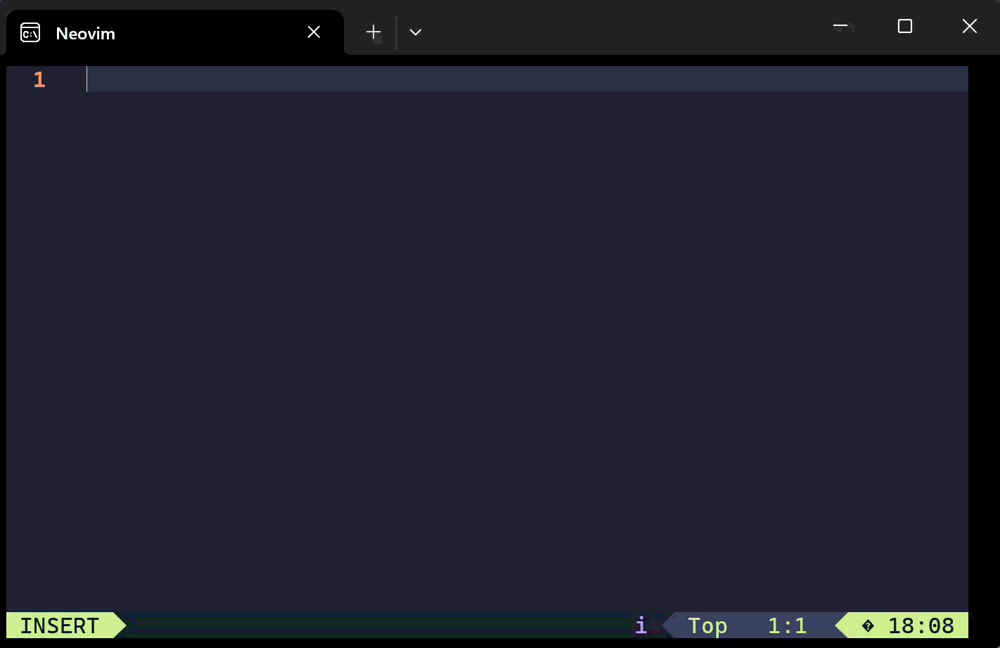

# skk-lite.nvim

Neovim専用のPure Lua SKKです。挿入モードとコマンドラインモードに対応し、入力時にNode.jsやDenopsなどの外部ランタイムを必要としません。



主な機能:

- ローマ字かな入力、漢字変換、送り仮名、接頭辞・接尾辞
- 候補一覧、注釈表示、候補学習、ユーザー辞書、読み補完
- カタカナ、半角カタカナ、全角英数、Abbrev、数字変換
- 挿入モード、`:`、`/`、`?` のコマンドライン入力
- フローティングウィンドウを使った単語登録
- SKK辞書のダウンロード、EUC-JP/UTF-8変換、JSON生成

## 必要環境

- Neovim 0.10以降
- 生成済みJSON辞書
- 辞書をダウンロードする場合のみ `curl`（Windows 10以降には標準搭載）

## インストール

`lazy.nvim` を使う場合は次の設定だけでインストールできます。既定値で使うなら `setup()` は不要です。

```lua
{
  "takeshy/skk-lite.nvim",
}
```

プラグイン管理ツールを使わない場合は、標準packageとしてプラグインディレクトリを次のように配置します。

```text
stdpath('data')/site/pack/skk-lite/start/skk-lite.nvim
```

`start` 配下にあればNeovim起動時に自動ロードされます。Windowsの標準構成では次の場所です。

```text
%LOCALAPPDATA%/nvim-data/site/pack/skk-lite/start/skk-lite.nvim
```

## 設定

既定値のまま使う場合、`setup()` の記述は不要です。設定を変更する場合は `init.lua` などから呼び出します。

```lua
require("skk_lite").setup({
  -- SKK-JISYO* と生成するdictionary.jsonを置くディレクトリ
  dictionary_dir = vim.fn.stdpath("data") .. "/skk-lite/dictionary",

  -- nilならdictionary_dir/dictionary.json
  dictionary_path = nil,

  -- "auto"、"euc-jp"、"utf-8"
  dictionary_encoding = "auto",

  -- nilならdictionary_dir内のSKK-JISYO*を名前順にすべて使用
  -- dictionary_files = { "SKK-JISYO.L", "SKK-JISYO.jinmei" },

  state_path = vim.fn.stdpath("data") .. "/skk-lite/state.json",
  -- 学習データを書き出すまでの待ち時間（ミリ秒）
  state_save_delay = 200,
  mappings = true,
})
```

既定のデータ配置:

```text
nvim-data/
└─ skk-lite/
   ├─ dictionary/
   │  ├─ dictionary.json
   │  └─ SKK-JISYO.*       # ダウンロードした場合
   └─ state.json           # ユーザー辞書と学習履歴
```

約13MBの `dictionary.json` は最初の変換時に遅延読み込みされるため、Neovimの起動時には読み込みません。

## 辞書のインストール

初回だけ次のコマンドを実行すると、辞書のダウンロードとJSON生成を続けて行います。

```vim
:SkkLiteInstallDictionary
```

保存先を指定する場合は `:SkkLiteInstallDictionary C:/skk/dictionary` のように指定できます。辞書のダウンロードには `curl` を使用し、Node.js、Denops、gzipは必要ありません。

### ダウンロードとJSON生成を個別に行う

辞書の取得とJSON変換は分離されています。ダウンロード完了通知が出てからコンパイルしてください。

```vim
:SkkLiteDownloadDictionary
:SkkLiteCompileDictionary
```

ディレクトリを指定する場合:

```vim
:SkkLiteDownloadDictionary C:/skk/dictionary
:SkkLiteCompileDictionary C:/skk/dictionary
```

### ダウンロード

`:SkkLiteDownloadDictionary` は [dictionary_sources.json](dictionary_sources.json) に定義された以下の辞書を公式リポジトリから取得します。未圧縮ファイルを直接取得するため、展開ツールは不要です。

- `SKK-JISYO.L`
- `SKK-JISYO.geo`
- `SKK-JISYO.jinmei`
- `SKK-JISYO.propernoun`
- `SKK-JISYO.station`

ダウンロードは非同期です。処理中もNeovimを操作できます。

### JSON変換

`:SkkLiteCompileDictionary` は設定されたディレクトリ内の展開済み `SKK-JISYO*` を統合し、`dictionary.json` を生成します。

- UTF-8とEUC-JPを自動判定
- 複数辞書を指定順またはファイル名順で統合
- 候補の `;注釈` を保持
- 注釈を除いた単語単位で重複を除去
- 生成後は新しいJSONを即座に再読込

`dictionary_path` を設定した場合、引数なしの `:SkkLiteCompileDictionary` はそのパスへ出力します。コマンドにディレクトリ引数を付けた場合は、指定ディレクトリの `dictionary.json` を使用します。

### スクリプトを直接実行する

プラグインのルートディレクトリで実行します。

```sh
nvim --headless -u NONE -l scripts/download_dictionary.lua /path/to/skk/dictionary
nvim --headless -u NONE -l scripts/compile_dictionary.lua /path/to/skk/dictionary
```

## 基本操作

| キー | 動作 |
| --- | --- |
| `<C-j>` | SKKを有効化。変換中は候補または読みを確定 |
| `l` / `L` | SKKを無効化 / 全角英数モード |
| 大文字 | 変換入力を開始 |
| `;` | Sticky Shift。変換中の2回目は送り仮名を開始 |
| `Space` | 変換、次候補、候補ページ送り |
| `x` / `X` | 前候補 / 現候補を学習・ユーザー辞書から削除 |
| `<C-g>` | 候補を取り消して読みに戻る。候補表示前で送り仮名入力中なら、送り仮名を読みへ畳み込み、1 つの見出しとして再変換できる状態にする |
| `A S D F J K L` | 一覧表示された候補を直接選択 |
| `Tab` | 学習済みの読みを補完・巡回 |
| `q` / `<C-q>` | カタカナ / 半角カタカナへ変換または入力モード切替 |
| `/` | Abbrevモード |
| `>` | 接頭辞・接尾辞変換 |
| `zh/zj/zk/zl` | `←/↓/↑/→` |
| `z.` `z,` `z-` `z/` `z[` `z]` | `…` `‥` `～` `・` `『` `』` |
| `z Space` | 全角空白 |

`n` は次の入力を待ち、`nn` で `ん` を確定します。たとえば `funniki` は `ふんいき`、`nna` は `んあ` になります。Space、Enter、数字、モード切替の前でも保留中の `n` は `ん` として確定します。

コマンドラインは通常のASCII入力で開始します。日本語を入力するときだけ `<C-j>` を押してください。コマンドラインを閉じるとSKKマッピングは撤去されます。

### キーマッピングと補完プラグイン

`mappings = true` の場合、通常時に設定する挿入モードマッピングはバッファローカルの `<C-j>` だけです。SKKを有効にしている間だけ、そのバッファの入力キーをSKKが受け取り、無効化時に既存のバッファローカルマッピングを復元します。コマンドラインの既存マッピングも同様に、SKK終了時に復元します。

SKK有効中は文字キー、`<CR>`、`<Tab>`などをSKKが優先するため、nvim-cmp、blink.cmp、autopairs、snippetの同じキーに対する処理は動作しません。独自に統合する場合は `mappings = false` にして、`:SkkLiteEnable`、`:SkkLiteDisable`、`:SkkLiteToggle` を利用してください。`setup()` は再実行できるため、自動ロード後に `mappings = false` を指定しても既定マッピングは撤去されます。

## 単語登録

候補がない場合、または最終候補の次へ進むと登録ウィンドウが開きます。登録欄はかな入力が有効な状態で開始します。

- `Enter`: 変換中の文字列を欄内へ確定。未変換時は単語を登録
- `<C-l>`: `llm-rewrite.nvim`がインストール済みなら、読みからLLM候補を取得
- `<C-g>` / `Escape`: 登録を取り消し、元の読みまたは最後の候補へ戻る
- `\u3042`、`¥u3042`、`￥u3042` + `Enter`: 欄内でUnicode文字へ置換
- 登録欄でも通常の変換、カタカナ、半角カタカナ、英数入力を利用可能

## コマンド

| コマンド | 動作 |
| --- | --- |
| `:SkkLiteEnable` | SKKを有効化 |
| `:SkkLiteDisable` | SKKを無効化 |
| `:SkkLiteToggle` | 有効・無効を切り替え |
| `:SkkLiteHealth` | 辞書パス、ロード状態、状態ファイルを表示 |
| `:SkkLiteInstallDictionary [directory]` | 辞書を取得し、JSONへ変換 |
| `:SkkLiteDownloadDictionary [directory]` | 辞書を取得・展開 |
| `:SkkLiteCompileDictionary [directory]` | `SKK-JISYO*` をJSONへ変換 |

現在の入力状態は `vim.g.skk_lite_mode` でも参照できます。詳細なヘルプは `:help skk-lite` で開けます。

## テスト

Linux / macOS:

```sh
plugin="$PWD"
nvim --clean --headless --cmd "set runtimepath+=$plugin" \
  -c "lua dofile('$plugin/tests/run.lua')" -c "qa!"
```

Windows PowerShell:

```powershell
$plugin = (Resolve-Path .).Path
$runner = Join-Path $plugin 'tests\run.lua'
nvim --clean --headless --cmd "set runtimepath+=$plugin" `
  -c "lua dofile([[$runner]])" -c "qa!"
```

辞書コンパイラ、EUC-JP変換、入力エンジン、永続化、登録UI、コマンドラインをテストします。
